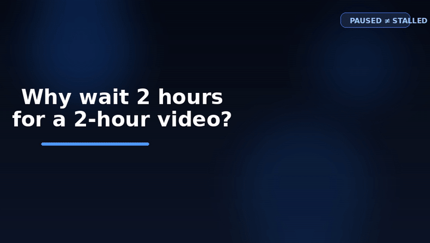

# Subtitler

Subtitler is a local-first Chrome companion for prerecorded media.

It generates synchronized subtitles or a full transcript without requiring you
to play an entire recording in real time.

<p align="center">
  
</p>

Traditional captioning:

`play audio -> transcribe -> caption appears`

Subtitler:

`process prerecorded audio ahead of playback -> captions are ready when needed`

## Why Subtitler?

- Transcribe recordings as files, not as a live microphone.
- Keep media local by default.
- Use generated captions even when platform captions are missing or poor.
- Keep player UI simple: **Create Subtitles** or **Get Full Transcript**.

## What it does

- Creates timestamped subtitles and a synchronized page overlay.
- Produces full transcripts without requiring full playback.
- Processes audio ahead of the current playhead when possible.
- Uses local FFmpeg and Whisper-compatible ASR.
- Exports TXT, timestamped TXT, SRT, VTT, and JSON.

## How it works

```text
Chrome extension
  -> Rust native engine
  -> FFmpeg audio pipeline
  -> Whisper ASR
  -> subtitles / transcript
```

Existing platform captions are an optional **Use Existing Captions** fast path.
**Generate with Subtitler** uses direct prerecorded-media acquisition and local
ASR; it does not depend on a platform caption track.

## Current support

| Source | Status |
| --- | --- |
| YouTube | Working in verified developer flow; platform-sensitive |
| Local and ordinary HTML5 media | Working |
| Webex | Working for authorized, accessible recordings |
| Zoom | Partial: generic-media path only |
| DRM or protected media | Not supported |

Verified developer checks include direct YouTube audio acquisition through
FFmpeg and local ASR, a generated single-overlay lifecycle with forward
seeking, authorized Webex completed-result recovery, all five export formats,
and Native Messaging smoke coverage. These checks do not imply universal
compatibility with every video, account, player, or protected recording.

## Quick start

Prerequisites: Node.js 20+, Rust stable with Windows MSVC tools, FFmpeg, a
Whisper-compatible CLI, and a local model for real transcription.

```powershell
git clone https://github.com/dragonscypher/Subtitler.git
cd Subtitler
npm --prefix extension install
npm --prefix extension run build
cargo build --manifest-path native/Cargo.toml --release -p subtitler-native-host
```

Load `extension/dist` as an unpacked extension in Chrome. Then follow the
development Native Messaging registration instructions in
[Installation](docs/INSTALLATION.md). The project does not yet ship a signed
end-user installer or bundled ASR/model binaries.

## Build and test

Run complete local verification:

```powershell
.\scripts\verify.ps1
```

For scoped commands, test media prerequisites, and opt-in real local pipeline
checks, see [Testing](docs/TESTING.md).

## Privacy

- Local ASR is default; cloud processing requires explicit per-job awareness.
- Temporary media and audio are job-private and cleaned after processing.
- Do not log media bytes, transcript content, authentication tokens, or signed URLs.
- Never bypass DRM, encryption, authentication, or access controls.

## Architecture and docs

- [Architecture](docs/ARCHITECTURE.md)
- [Installation](docs/INSTALLATION.md)
- [Testing](docs/TESTING.md)
- [Security model](docs/SECURITY.md)
- [Safe demo recording script](docs/DEMO_RECORDING.md)

## Limitations

- YouTube acquisition can change with upstream proof-of-origin requirements.
- Webex and Zoom require a normal, authorized, unencrypted media path.
- Live meetings, livestreams, arbitrary translation targets, and DRM media are
  outside V1 scope.
- Speaker diarization and cloud providers remain optional/limited paths.

## License

[MIT](LICENSE)
